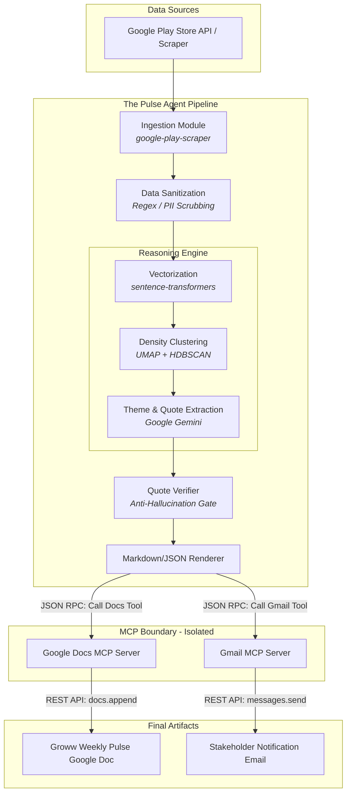
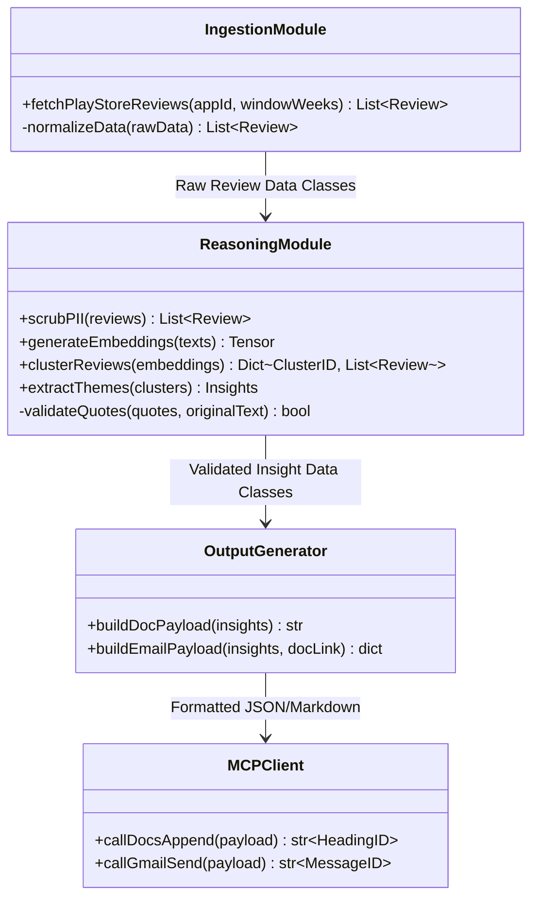
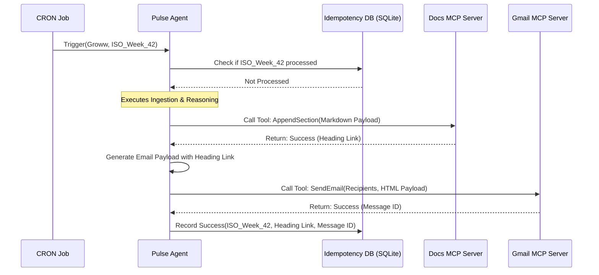

# System Architecture: Groww Weekly Review Pulse

This document outlines the architecture, data flow, component boundaries, and security model for the Groww Weekly Review Pulse. 

## 1. High-Level Architecture & Data Flow

The system is designed as a unidirectional, fault-tolerant data pipeline. It extracts unstructured data, enforces structure through ML, and delegates external side-effects (like emails) to isolated Model Context Protocol (MCP) servers.

## 2. Component Design & Responsibilities

The codebase is strictly modular to ensure that swapping out an LLM provider or an ingestion source does not require a complete rewrite.

## 3. Technology Stack & Rationale

| Component | Technology Choice | Rationale |
| :--- | :--- | :--- |
| **Ingestion** | `google-play-scraper` (Python) | Robust, open-source library that handles pagination and API limits effectively without requiring direct Google Developer Console credentials. |
| **Embeddings** | `sentence-transformers` | Runs locally, incredibly fast, and avoids token costs for simply clustering data prior to the heavy LLM lifting. |
| **Clustering** | `UMAP` + `HDBSCAN` | UMAP reduces high-dimensional vector space so HDBSCAN can find dense clusters of similar reviews. This is far superior to K-Means because it doesn't force outliers into clusters (HDBSCAN has a concept of "noise"). |
| **LLM Synthesis** | Google Gemini (1.5 Flash/Pro) | Chosen specifically for its massive context window (1M+ tokens), allowing us to pass entire clusters of reviews in a single prompt for accurate theme naming. |
| **Delivery** | Model Context Protocol (MCP) | Ensures the core reasoning agent is completely decoupled from Google Workspace authentication. |

## 4. MCP Integration & Security Sequence

The agent operates in a "Zero Trust" model regarding Google Workspace. It does not hold OAuth tokens.

